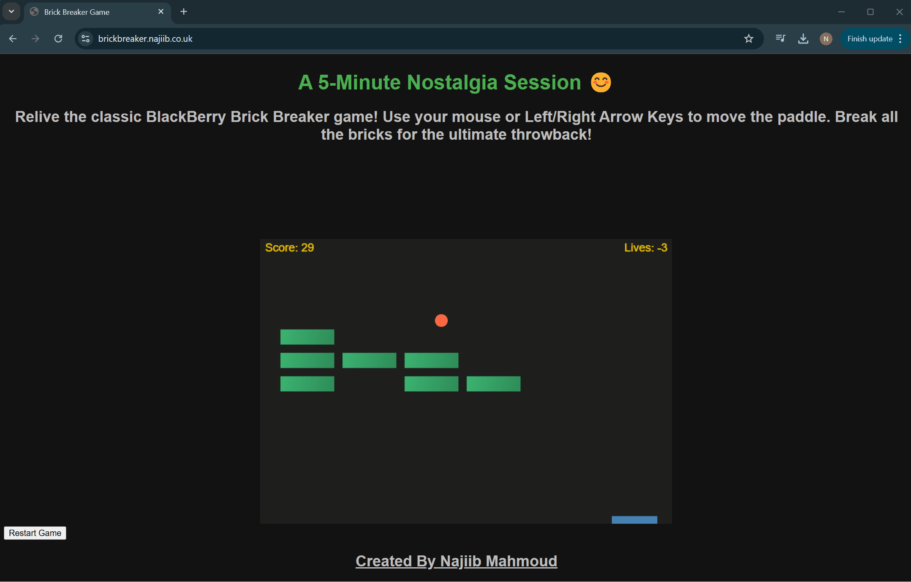

# 🎮 Brick Breaker Game Deployed on AWS ECS 🚀  

Welcome to the **Brick Breaker Game**—a nostalgic arcade experience brought to life through **modern DevOps practices**. This project combines **Docker**, **Terraform**, and **AWS ECS** to demonstrate the deployment of a scalable web application in the cloud. The game is live and accessible at [https://brickbreaker.najiib.co.uk](https://brickbreaker.najiib.co.uk).

*Relive the classic gameplay experience in the cloud!*

---

## Features  

- **Fully Containerised Application**: Deployed using a multi-stage Dockerfile.  
- **Cloud-Native Deployment**: Hosted on **AWS ECS**, with scalability and high availability.  
- **Secure Infrastructure**: HTTPS enabled using **Route53** and **TLS certificates**.  
- **CI/CD Pipelines**: Includes workflows for **Docker** and **Terraform**, ensuring seamless deployments.  
- **Trivy Integration**: Vulnerability scanning for container security.  
- **Modular Terraform**: Scalable infrastructure as code using reusable modules.

---

## 🚀 How to Play Locally

### 1️⃣ Install Dependencies:
`yarn install`

---

### 2️⃣ Build the Application:
`yarn build`

---

### 3️⃣ Serve Locally:
`yarn global add serve`  
`serve -s build`

---

### 4️⃣ Access the Game:
🌐 Open your browser and go to: [http://localhost:3000](http://localhost:3000)
